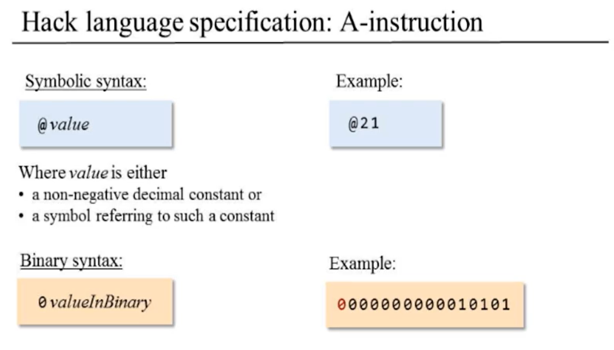
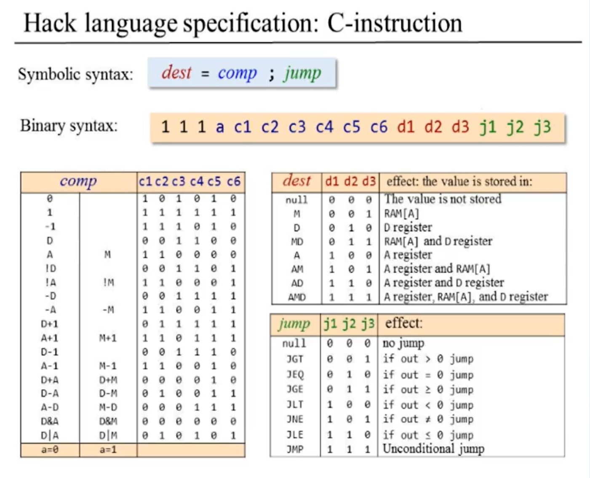
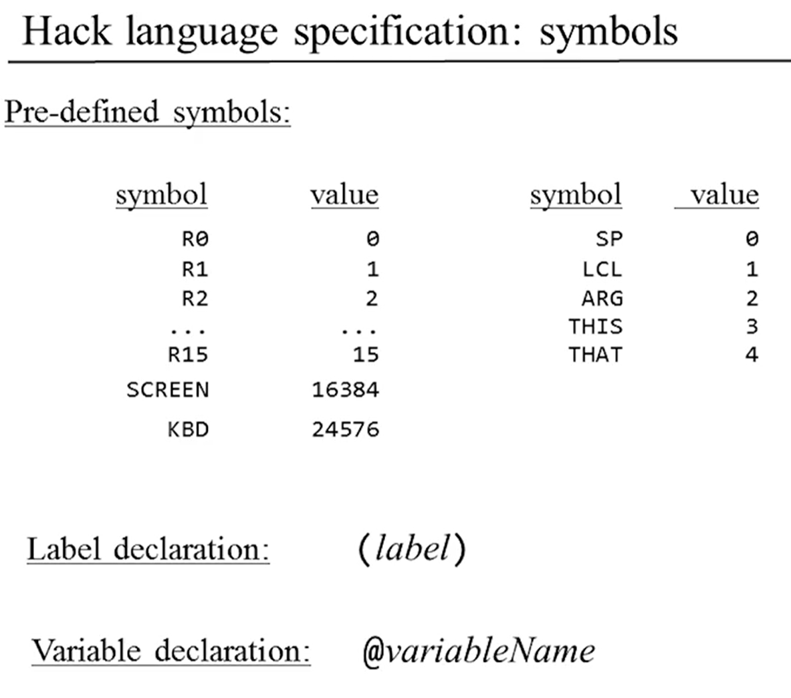

# hack-assembler
Assembler for the Hack computer written in Rust.

# What is Hack?
Hack is an assembly language included in the online course ["Build a Modern Computer from First Principles: From Nand to Tetris"](https://www.coursera.org/learn/build-a-computer/home/welcome) and the book "The Elements of Computing Systems" by Noam Nisan and Shimon Schocken (MIT Press). Hack is also the name of the computer Noam and Shimon designed as the project for the course "From Nand to Tetris".

# Hack Specification
The Hack assembly language has two types of instructions:

## A Instructions

## C Instructions

## Symbols

# Hack Assembler
The assembler compiles symbolic Hack code to binary code that the Hack machine understands.
This project is structured in four parts:
1. [Parser](src/hack_parser.rs)
2. [Emitter](src/hack_emitter.rs)
3. [Assembler](src/hack_assembler.rs)
4. [Command Line Interface for the Assembler](src/main.rs)

# Want to learn more about Hack?

Check out the [course video on Hack assembly](https://www.coursera.org/learn/build-a-computer/lecture/AYPo6/unit-6-2-the-hack-assembly-language) and the whole [From Nand to Tetris course](https://www.coursera.org/learn/build-a-computer/home/welcome).

# Credits
Thanks to Noam Nisan and Shimon Schocken for developing the amazing From Nand to Tetris course and Bodil Stokke for her [excellent tutorial](https://bodil.lol/parser-combinators/) on parser combinators in Rust

# License
[Creative Commons Attribution-NonCommercial-ShareAlike 4.0 International License](https://creativecommons.org/licenses/by-nc-sa/4.0/)